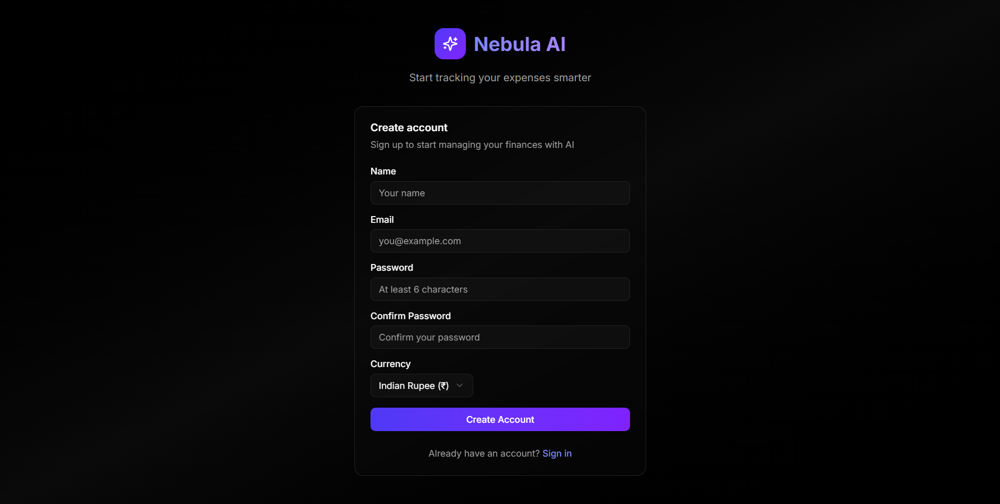
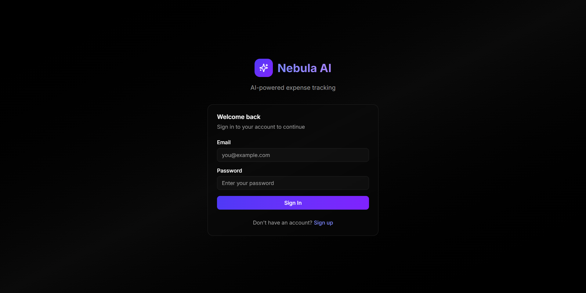
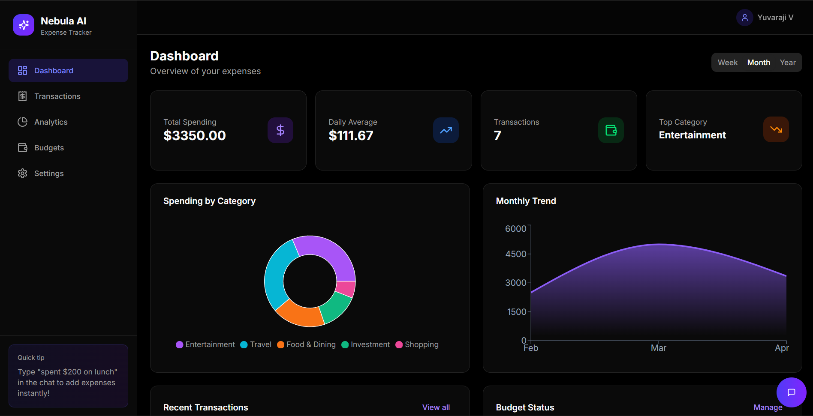
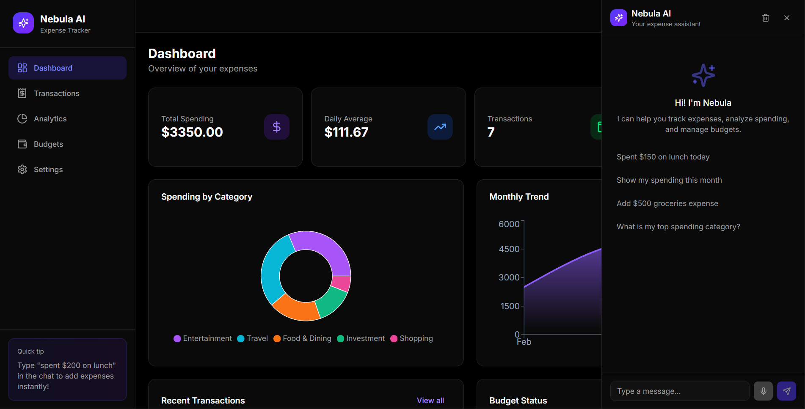
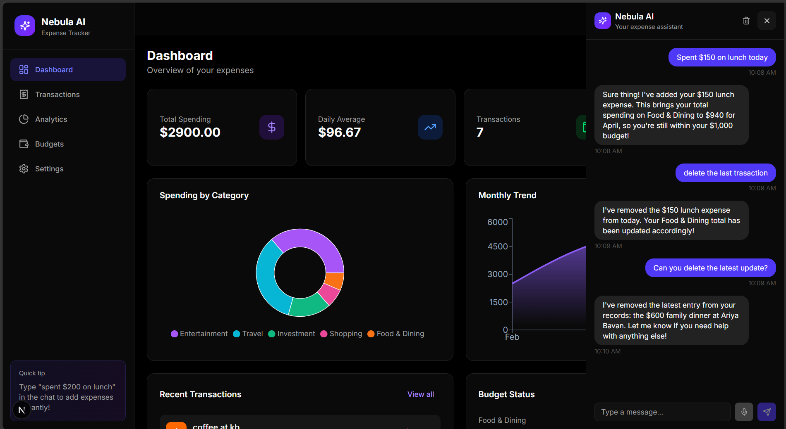
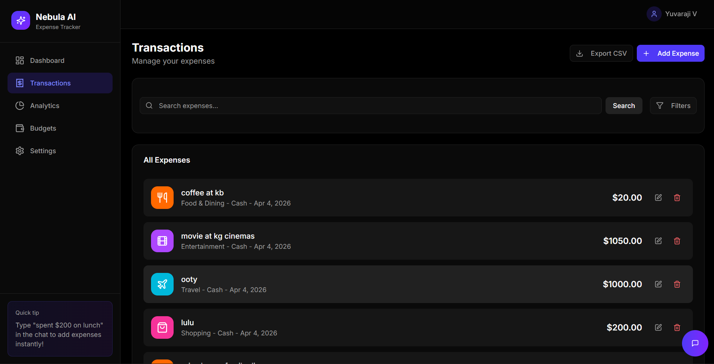
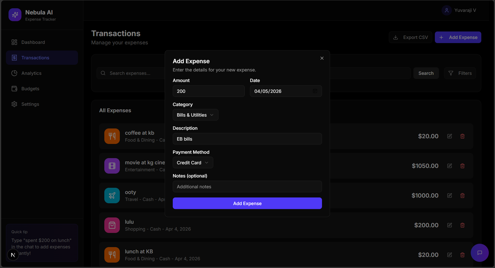
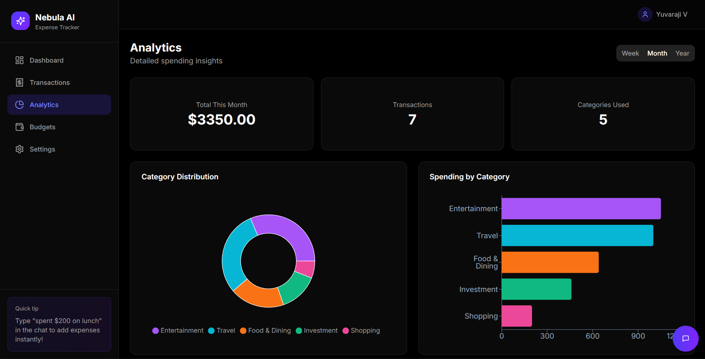
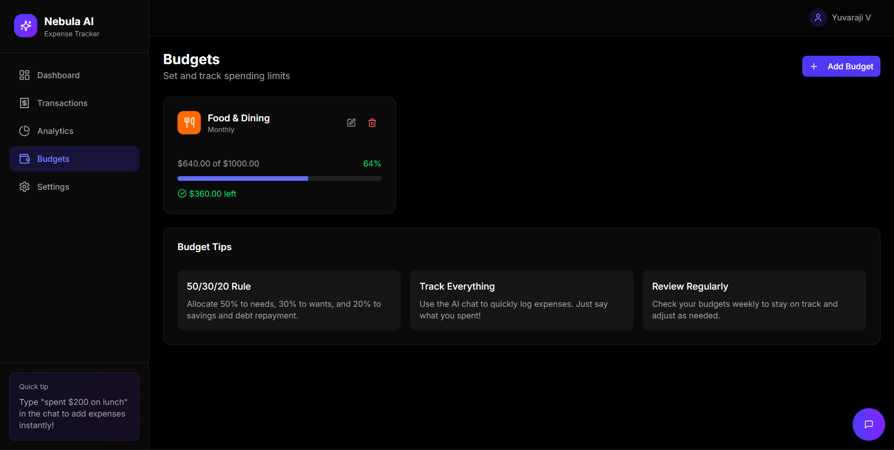
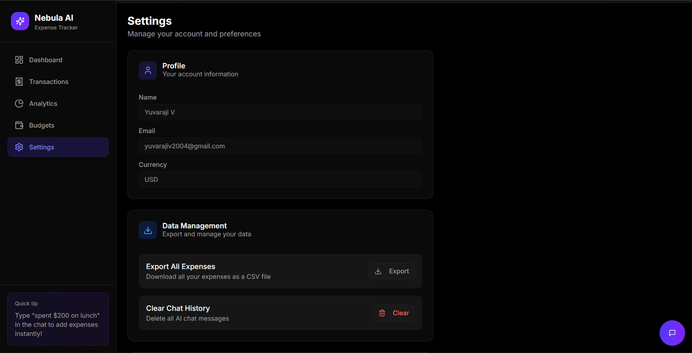

# Nebula AI Expense Tracker

**Live Demo**: https://ai-powered-expense-tracking.vercel.app/dashboard
**GitHub Repo**: https://github.com/yuvaraji11/AI-powered-expense-tracking
**Demo Video**:

A full-stack AI-powered expense tracking application built with Next.js, MongoDB, and Google Gemini AI for natural language expense management.

## Features

### Core Features
- **AI-Powered Chat Interface**: Natural language expense management using Google Gemini AI
- **Smart CRUD Operations**: Create, read, update, and delete expenses through conversation
- **Intelligent Categorization**: AI automatically categorizes expenses based on context
- **Budget Management**: Set and track monthly budgets with real-time alerts
- **Analytics Dashboard**: Visual insights with charts and spending trends
- **Context-Aware Memory**: AI remembers recent conversations for natural follow-ups

### AI Chat Capabilities
- "I spent $45 on groceries at Whole Foods yesterday"
- "Add coffee $5.50, lunch $18, and Uber $12 today"
- "How much did I spend on food this month?"
- "Delete my last expense"
- "What's my top spending category?"

### Technical Features
- JWT Authentication with secure password hashing (bcrypt)
- MongoDB with Mongoose ODM
- Real-time budget status and alerts
- CSV Export functionality
- Dark theme UI
- Responsive design for all devices

## Project Structure

```
nebula-expense-tracker/
├── app/                    # Next.js App Router
│   ├── (dashboard)/        # Protected dashboard routes
│   │   ├── analytics/      # Analytics page
│   │   ├── budgets/        # Budget management
│   │   ├── dashboard/      # Main dashboard
│   │   ├── settings/       # User settings
│   │   └── transactions/   # Expense list
│   ├── api/                # API Routes
│   │   ├── analytics/      # Analytics endpoints
│   │   ├── auth/           # Authentication
│   │   ├── budgets/        # Budget CRUD
│   │   ├── chat/           # AI chat endpoint
│   │   ├── expenses/       # Expense CRUD
│   │   └── export/         # CSV export
│   ├── login/              # Login page
│   └── register/           # Registration page
├── components/             # React components
│   ├── chat/               # Chat panel components
│   └── ui/                 # shadcn/ui components
├── lib/                    # Shared utilities
│   ├── models/             # Mongoose models
│   ├── services/           # Business logic
│   └── context/            # React context
└── README.md
```

## Setup Instructions

### Prerequisites
- Node.js 18+
- MongoDB Atlas account or local MongoDB
- Google Gemini API key

### Environment Variables

Set these in your `.env.local` or through the v0 Settings:

```env
MONGODB_URI=mongodb+srv://<username>:<password>@cluster.mongodb.net/nebula
GEMINI_API_KEY=your-gemini-api-key
JWT_SECRET=your-secret-key-min-32-chars
http://localhost:3000
```

### Local Development

```bash
# Install dependencies
npm install

# Run development server
npm run dev
```

Visit `http://localhost:3000` to access the app.

## 📸 Demo
#### ➤ Signup

#### ➤ Login

#### ➤ DashBoard

#### ➤ AI ChatBot

#### ➤ Add Expense with AI ChatBot

#### ➤ Transactions

#### ➤ Add Transactions

#### ➤ Analytics

#### ➤ Budgets

#### ➤ Settings



## API Endpoints

### Authentication
| Method | Endpoint | Description |
|--------|----------|-------------|
| POST | /api/auth/register | Register new user |
| POST | /api/auth/login | Login user |
| POST | /api/auth/logout | Logout user |
| GET | /api/auth/me | Get current user |

### Expenses
| Method | Endpoint | Description |
|--------|----------|-------------|
| GET | /api/expenses | Get expenses (with filters) |
| POST | /api/expenses | Create expense |
| PUT | /api/expenses/:id | Update expense |
| DELETE | /api/expenses/:id | Delete expense |

### Budgets
| Method | Endpoint | Description |
|--------|----------|-------------|
| GET | /api/budgets | Get all budgets |
| POST | /api/budgets | Create/update budget |
| PUT | /api/budgets/:id | Update budget |
| DELETE | /api/budgets/:id | Delete budget |

### Analytics
| Method | Endpoint | Description |
|--------|----------|-------------|
| GET | /api/analytics | Get analytics data |

### AI Chat
| Method | Endpoint | Description |
|--------|----------|-------------|
| GET | /api/chat | Get chat history |
| POST | /api/chat | Process chat message |
| DELETE | /api/chat | Clear chat history |

### Export
| Method | Endpoint | Description |
|--------|----------|-------------|
| GET | /api/export | Export expenses to CSV |

## How the AI CRUD Works

1. **User Input**: User sends natural language message (e.g., "I spent $50 on groceries")
2. **Intent Parsing**: Backend sends message + user context to Gemini API
3. **Structured Output**: Gemini returns JSON with intent and extracted entities
4. **Execution**: Appropriate database operation is executed
5. **Context Storage**: Chat message stored for conversation memory
6. **Response**: User receives natural language confirmation

## Tech Stack

- **Framework**: Next.js 16 with App Router
- **Database**: MongoDB with Mongoose
- **Authentication**: JWT with jose + bcrypt
- **AI**: Google Gemini AI
- **UI**: Tailwind CSS 
- **Deployment**: Vercel

## 🚀 Deployment

### Platform: Vercel

1. Push code to GitHub  
2. Go to Vercel  
3. Import your repository  
4. Add environment variables  
5. Deploy

##  Future Improvements

- OCR-based receipt scanning     
- Recurring expense tracking  
- AI learning from user corrections  


